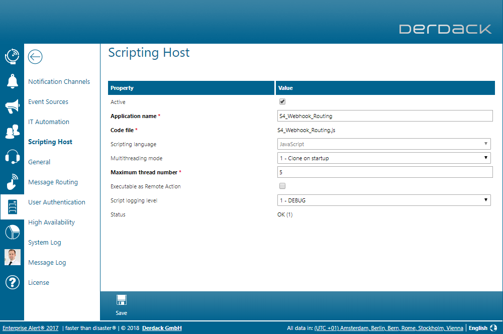
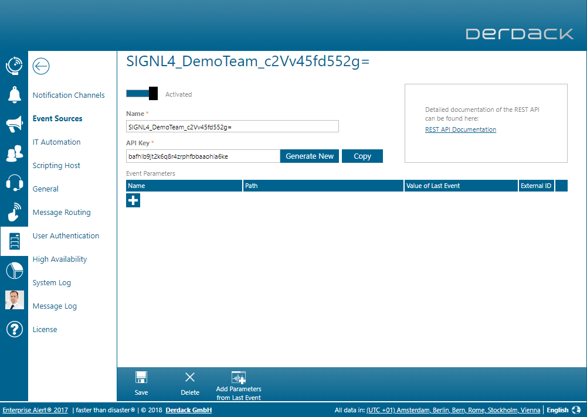
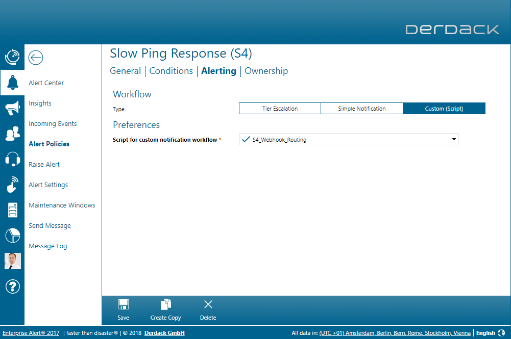

# Notifying SIGNL4 teams from EnterpriseAlert
This repository contains a script that you can use in EnterpriseAlert to easily send alert notifications to SIGNL4 teams.
This can be very helpful as it allows to utilize your secure and well managed EnterpriseAlert system as an on-premises proxy to the cloud.

The workflow consists of a REST source in EA and an alert policy.
For each team in SIGNL4, you need one REST source and one alert policy.
When one of your teams send data to its EnterpriseAlert REST source, this event triggers the policy of that team.
The alert policy addresses the script in this repro which sends the event to the webhook of that team in SIGNL4.

Follow the steps below to prepare your EnterpriseAlert system.

##Add a script to the Scripting Host
1. Open the Scripting Host in EA under System -> ScriptingHost
1. Click 'Create New' to add a new script
1. Select a name for the new script and ensure to have the same settings as in the below screenhot
1. Click 'Save'
1. Select 'JavaScript' under 'Scripting language dropdown'
1. Open the file 'WebhookGateway.js' from this repo in your favorite text editor, copy all its contents and paste them into the script text area of thew script you are about to create
1. Click 'Save' to save the new script in EnterpriseAlert

##Activating the workflow for a SIGNL4

Each time you wish to povision the notification workflow to a new SIGNL4 team, follow these steps:

1. Open the event sources in EA under System -> Event Sources
1. Click 'Create New' and select 'REST Client'
1. Identify the team secret from the SIGNL4 team you wish to include. Details where to find it can be found [here](https://signl4.drift.help/article/what-and-where-is-my-'team-secret'/).
1. For security reasons, convert the team secret to Base64, e.g. [here](https://www.base64encode.org/)
1. The name of the REST API source for your SIGNL4 team must be in this format: SIGNL4_[anyname]_[Base64teamsecret]
    1. [anyname] can be any name that helps you to identify this team, e.g. 'Support'
    1. [Base64teamsecret] is the team secret in Base64 format you created earlier
1. Once your source looks similar as in the example below, click 'Save'
    
1. Next, create an Alert Policy for this team under 'Alerts' -> 'Alert Policies' -> 'Create New'
1. Enter a name for the new policy, e.g. 'SIGNL4 Support Team Alerts'
1. Select the previously created event source as source for this policy and click 'Next'
1. Leave the conditions as they are and proceed
1. Under 'Alerting' select 'Custom (Script)' as workflow type and choose the script you have deployed above as target.
1. Once you policy looks similar as in the screenshot below, click 'Save'
    

